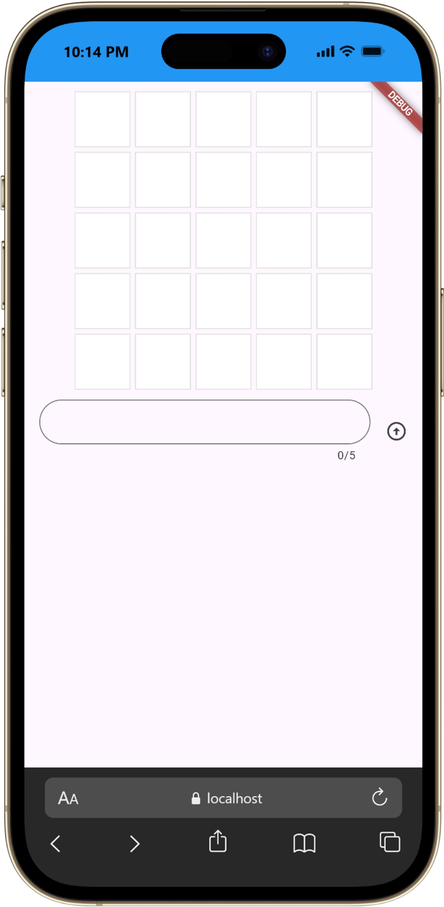
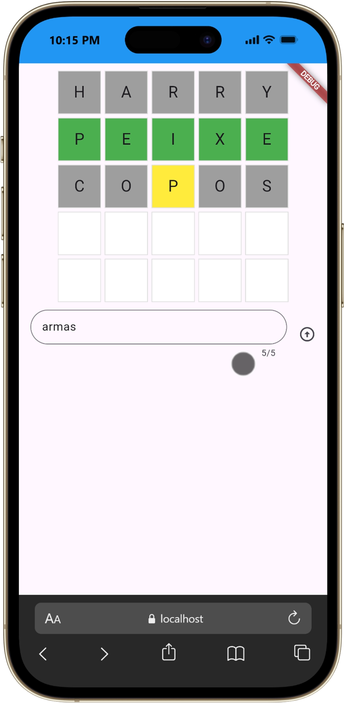

# Birdle

Birdle é um jogo de adivinhação de palavras desenvolvido em Flutter, inspirado na mecânica de jogos como Wordle. O objetivo é descobrir a palavra secreta em até cinco tentativas, com feedback visual para cada letra enviada.

## Funcionalidades

- Entrada de chutes com validação de palavra e tamanho.
- Feedback visual por cor para indicar acerto, posição correta e letra ausente.
- Limite de cinco tentativas por partida.
- Interface simples e responsiva com foco em usabilidade.

## Tecnologias

- Flutter
- Dart

## Como executar

1. Instale o Flutter SDK e configure o ambiente local.
2. Clone o repositório.
3. Execute o comando abaixo na raiz do projeto:

```bash
flutter pub get
flutter run
```

## Estrutura principal

- `lib/main.dart`: interface principal e fluxo de entrada do jogador.
- `lib/game.dart`: regras do jogo, validação das palavras e avaliação dos chutes.





## Contribuição

Contribuições são bem-vindas.

Se quiser colaborar, siga estes passos:

1. Faça um fork do projeto.
2. Crie uma branch para sua alteração.
3. Implemente sua melhoria com commits claros.
4. Abra um pull request descrevendo o que foi feito.

## Observações

- O jogo aceita apenas palavras válidas com cinco letras.
- A lista de palavras permitidas está definida em `lib/game.dart`.


